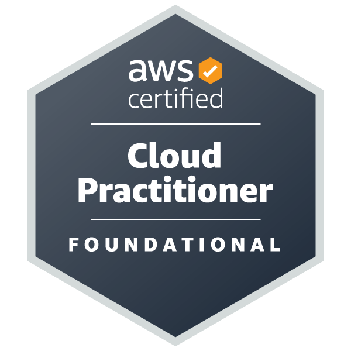

# Hey, I'm Tamara 👋

☁️ Air Force Veteran | Cloud Engineering Student

Air Force Veteran transitioning into cloud computing. Currently pursuing a B.S. in Cloud Engineering at Keiser University while building hands-on AWS projects and documenting the journey publicly.
️ 
## Certifications

## Currently Learning
- AWS Solutions Architect Associate (SAA-C03)
- Git & GitHub
- Linux
- Terraform

## Current Goal
- Build hands-on AWS projects and document the journey.

## Projects
- Cloud Portfolio
- AWS Learning Journal

🌐 cloudedbyt.com
